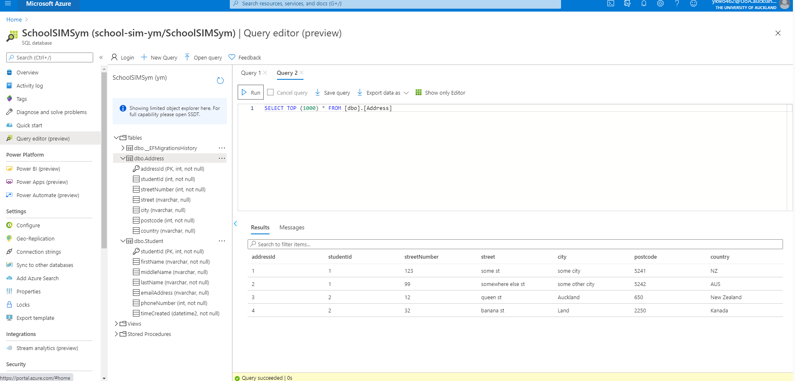
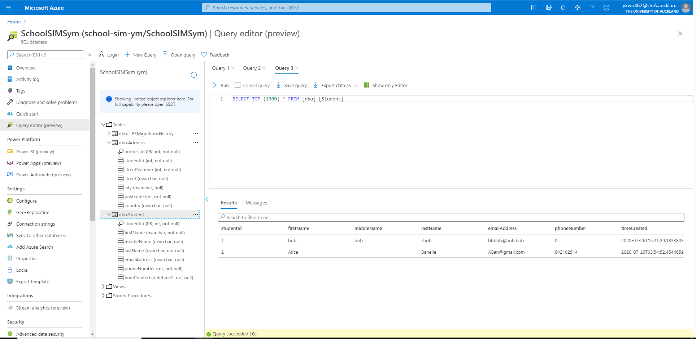
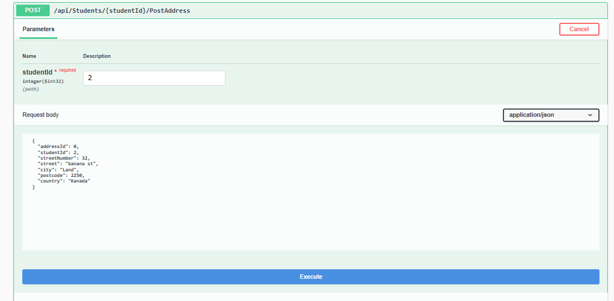
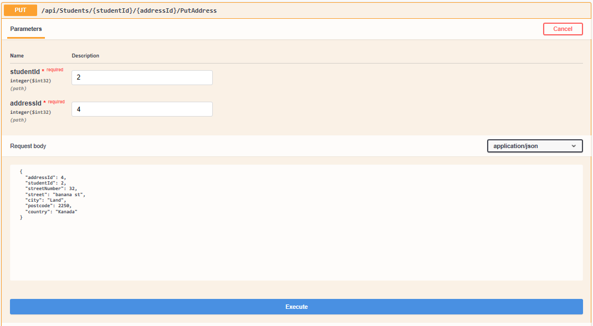
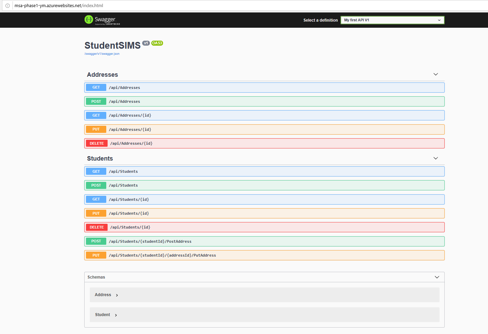

# MSA 2020 Databases and API

website url: <http://msa-phase1-ym.azurewebsites.net/>

## SQL database through the Query editor

These screenshots show the query editor from the azure website showing both tables for Student and Address with appropriate examples. It also shows the Address table with appropriate attributes. StudentId, Street Number, Street, Suburb, City, Postcode and Country.

## CRUD requests

There are the basic CRUD requests in both the Student and Address table, a get method, post method, put method and delete method. as seen in the Screenshot of Swagger UI showing all api endpoints

an API method that adds a new address for a student using their student ID and an API method that changes the address of a student using his/her StudentId was also added in the StudentController

## Screenshot of Swagger UI showing all api endpoints

